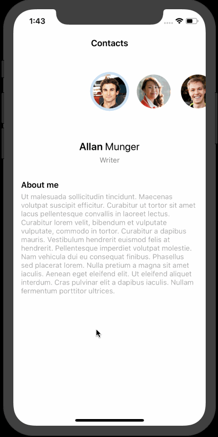

# Contacts

Contacts is an app that allows a user to scroll people's photos/avatars and their information in a **UICollectionView** and a **UITableView**, respectively.

## Getting Started

This app was created to learn about **UIScrollViewDelegate** methods and the behaviors of content offset of **UICollectionView** and **UITableView** during scrolling. This app was also built to practice JSON parsing using **JSONSerialization** and customizing labels using **attributedText** property.

## App Walkthrough GIF

This GIF shows the app in action.

## Lessons Learned

1. **UICollectionView** and **UITableView** both inherit from **UIScrollView**. Also, both of their delegates inherit from **UIScrollViewDelegate**.
2. Variables declared in the original class is accessible in the extension of that class.
3. In **UICollectionView**, items are laid out along a line that is orthagonal to the scroll axis. The space between these lines, along which the items are laid out, can be adjusted using **minimumLineSpacing** property of **UICollectionViewFlowLayout**. Similarly, the spacing between items within the same line can be adjusted using **minimumInteritemSpacing** property.
4. When adding a navigation bar without a **UINavigationController**, simply set the title to it's **topItem**.
5. Use  the **scrollViewWillEndDragging(_:withVelocity:targetContentOffset:)** method to adjust where a scroll view will land.
6. A view of the same height and width could be made circular using it's **layer.cornerRadius** property.
7. To disable a view's layer animation, use **CATransaction** class.

## License

    Copyright 2019 Soumik Barua

    Licensed under the Apache License, Version 2.0 (the "License");
    you may not use this file except in compliance with the License.
    You may obtain a copy of the License at

    http://www.apache.org/licenses/LICENSE-2.0

    Unless required by applicable law or agreed to in writing, software
    distributed under the License is distributed on an "AS IS" BASIS,
    WITHOUT WARRANTIES OR CONDITIONS OF ANY KIND, either express or implied.
    See the License for the specific language governing permissions and
    limitations under the License.
